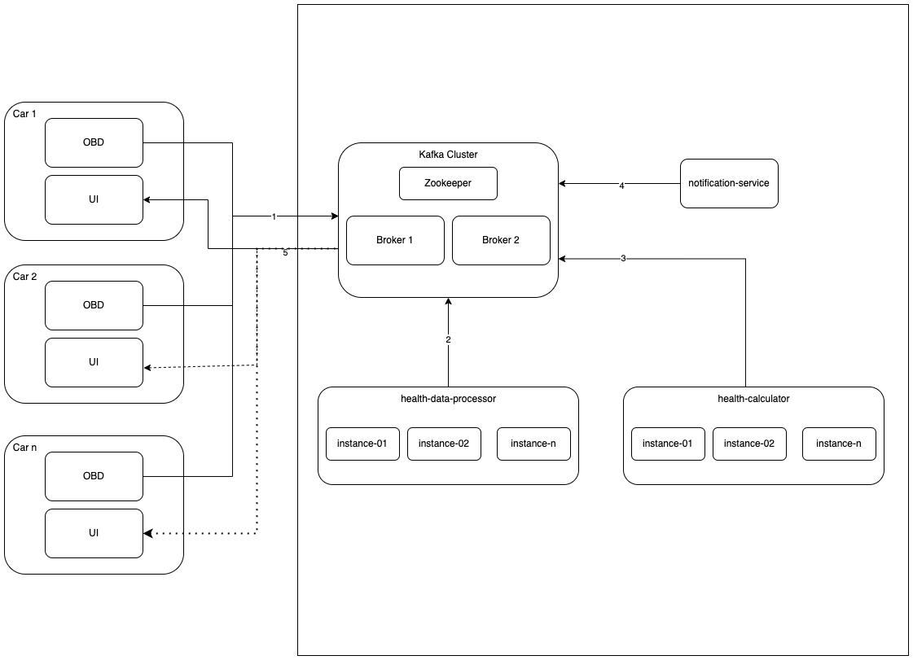

# Battery Health Warning System

## Prerequisite

- Java 21
- Docker

## Architecture



### Kafka Topics used

| topic name                    | usage                                                                        |
|-------------------------------|------------------------------------------------------------------------------|
| poc-battery-data-collection   | to collect data from vehicle's OBD                                           |
| poc-battery-data-processed    | structured data processed by health-data-processor service                   |
| poc-battery-data-notification | all notifications to all cars to be used by notification-service to send out |
| poc-notification-[car-id]     | one topic for one car-id                                                     |


## How to run the project

### Infrastructure

Kafka is required for messaging functionality, docker compose file contains 1 zookepper, 2 kafka broker and kafka-ui
instance. start them using following command

```shell
docker compose up -d
```

services will be available on localhost as following ports

| Service   | Port  |
|-----------|-------|
| zookeeper | 22181 |
| kafka-1   | 29092 |
| kafka-2   | 39092 |
| kakfa-ui  | 8081  |

### Services

Start `health-calculator`,`health-data-processor` and `notificaiton-service` with IDE or in terminal using following
command in each module directory

```shell
mvn spring-boot:run
```

### stop the project

To stop the running infrastructure, run following command

```shell
docker compose down
```

To Stop service kill the process from IDE or terminal.